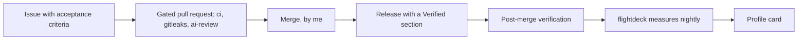

# Arthur Paula

Senior technical program leader. Platform and API modernization, AI/ML program delivery.

> Claude writes the code in these repositories. I set direction, make every decision recorded in the ADRs, define what gets measured and how, review every pull request, and merge. The judgment is mine. The typing is not.

Live. Measured nightly from the GitHub API by flightdeck. Every number links to its definition, gaming analysis, and cross-check.

## Selected work

Three repos, one operating model. Each entry states the decision I made, the evidence it produced, and the gate it had to clear before it shipped.

### [twoseat](https://github.com/Ap-Standard/twoseat)

**Decision:** Benchmark the reviewer before trusting it, and never let the gate block on its own failure. Deciding and enforcing live in different files, so the gate can be wrong about a diff without being able to stop anyone.

**Evidence:** Precision 97.4%, recall 100.0%, median $0.0092 per review, on 47 scored synthetic cases (48 in the corpus, one run per case), method in [bench/README.md](https://github.com/Ap-Standard/twoseat/blob/main/bench/README.md), as of the [v0.1.0 release](https://github.com/Ap-Standard/twoseat/releases/tag/v0.1.0) on 2026-09-04.

**Gate:** The scorecard shipped with its four corpus corrections disclosed in the same document, or it did not ship.

### [flightdeck](https://github.com/Ap-Standard/flightdeck)

**Decision:** A deploy is a verified release, not a green check. The dashboard reports team-level metrics only, by construction: the collector never requests an author, assignee, or login field, and a test fails the build if one appears.

**Evidence:** The [live dashboard](https://ap-standard.github.io/flightdeck/), measured nightly since its first run, with the raw numbers published at [latest.json](https://ap-standard.github.io/flightdeck/latest.json).

**Gate:** Every tile ships with its definition, its gaming analysis, and its cross-check, or it does not ship.

### [field-notes](https://github.com/Ap-Standard/field-notes)

**Decision:** Write the disclosure boundary ([decision 0003](docs/decisions/0003-sanitization-and-disclosure-policy.md)) before publishing anything drawn from production.

**Evidence:** The [case study](https://github.com/Ap-Standard/field-notes/blob/main/case-study/production-ai-platform.md): a production AI platform described at mechanism level, every figure with its measurement method.

**Gate:** Sanitization checklist on every note, checked at pull request review.

leaseq, a planned Postgres queue, was cut before any code was written: [decision 0005](docs/decisions/0005-portfolio-reset.md).

## What this portfolio cannot show

- No production traffic, no team, no on-call. These repos run no service and page nobody: [decision 0005](docs/decisions/0005-portfolio-reset.md).
- No time-to-restore data. flightdeck prints "not measured" for that tile rather than a zero, because no production service exists to restore: [risk R7](docs/risks.md).
- Synthetic benchmark scores are an upper bound. Real diffs run larger and noisier than seeded ones, and the gate's record on live pull requests is short: one reported finding, a P2 on a 44-file pull request, as of 2026-09-05, tracked in the open at [twoseat #12](https://github.com/Ap-Standard/twoseat/issues/12): [risk R4](docs/risks.md).
- Solo-maintainer merges have no second human. Machine gates carry the review weight, and that boundary is written rather than discovered: [decision 0002](docs/decisions/0002-solo-maintainer-review-policy.md), [risk R2](docs/risks.md).
- Nightly measurement can go silent. GitHub disables a scheduled workflow after 60 idle days; the card's printed date is how you would know: [risk R6](docs/risks.md).
- Hand-written code. Claude writes it; what a reader should and should not infer from that is recorded: [decision 0006](docs/decisions/0006-ai-authored-code-human-owned-decisions.md).

## Background

Program figures and track record below, as published on my
[LinkedIn profile](https://www.linkedin.com/in/arthurlpaula/):

I lead Gap Inc.'s platform modernization program: a $12M engineering labor budget across 25+ engineering and UX teams and four brands, with sub-2 second homepage load times, all eight page types green on Core Web Vitals, and a redirect fix that cut 1.26 seconds off load time and drove $63M+ in revenue. I also sit in Gap's Office of AI, bringing that rigor to AI-adoption programs across the company.

→ A net-new DoorDash vertical scaled from $0 to $240M and 10M+ users in under 18 months, leading a team of 50 across North America

→ AI agent infrastructure at Avolta that cut North American labor costs $68K weekly and lifted delivery velocity 9%, across 100+ airports and 11 business units

→ A $14M to $26M revenue climb and a $40M Series B at Local Kitchens, built on the AI operating foundation I designed

PMP, CSM.

## How I run a program

Most programs do not fail on strategy. They fail because nobody builds the machine that turns strategy into merged, verified, reversible change. Every piece of work here starts as an issue with acceptance criteria, ships through a pull request reviewed by CI, secret scanning, and the twoseat AI seat, lands in a release whose notes record post-publish verification, and gets measured nightly by flightdeck. The profile card at the top of this page is the last node of that loop.

## Production proof

The mechanisms in this portfolio run in production. I architect and operate a multi-tenant
AI platform, run on a gated trunk with two-seat AI review, post-merge verification, and
recurring reliability sweeps. It averages close to 5B tokens a month at a 97.8% cache hit
rate, measured by token accounting instrumented at every model call site and reconciled
against provider billing, as of March 2026. The code stays private; the mechanisms are being
published at [field-notes](https://github.com/Ap-Standard/field-notes).

## Currently exploring

Eval-gated autonomy: how much review authority an AI seat can hold before the false-block
tax exceeds the review time it saves. Updated 2026-09-05.

---

[Charter](docs/charter.md) · [Operating model](docs/operating-model.md) · [Decisions](docs/decisions/) · [Risks](docs/risks.md) · [Live metrics](https://ap-standard.github.io/flightdeck/) · [LinkedIn](https://www.linkedin.com/in/arthurlpaula/)
